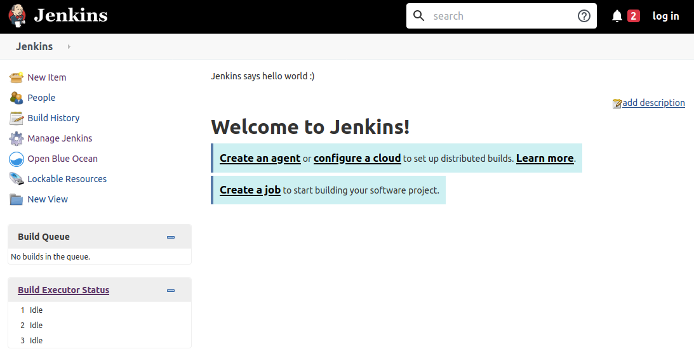

# Initial setup

> Note: if you do not have a Jenkins server
> provided by the trainer, head over and read
> [how to set Jenkins up](./setup-on-your-own.md)

In order for you to interact with Jenkins, you
need to have a fork of this git repository on your
own account. All your work will be made in the
fork, so you do not get disturbed by all the other
students.

## Tasks

- Fork the repository to your own github account.
- Clone the forked repository on your own machine.

Now you are able to push new changes to your
repository and have Jenkins build them

## Navigate to jenkins, is it working?

You should now be able to navigate to your Jenkins
instance! Go to `http://<your-hostname>:8080` and
you will be presented with a screen like the one
below. If you're trying this on you own computer
using docker, you'll use `localhost` as
`<your-hostname>` otherwise for the purpose of
this excercise, use the provided public
hostname/ip.

Click login, and use the username `admin` and your
password.
