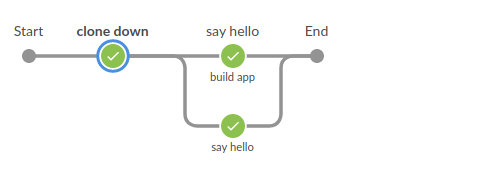

# Editing your pipeline

In the previous exercise, we used the GUI to create our pipeline. And while that is helpfull, we also need to be suficcient to edit the script by hand as well.
In this exercise you will:

* Use the replay feature for fast iteration of build steps.
* Use different agents for building steps
* Use stash and unstash for sending your data from one agent or step to another
* Use the built-in test report plugin as a post step to show reports of Unit tests for each build.

## Getting help from Jenkins

There are two different code generators in Jenkins when using the classical UI.

* **Snippet generator** is there to help you make the right syntax for the different steps inside a job.
* **Declarative Directive Generator** is there to help you make the right syntax for the structure of the job itself, with agtens, parallel runs etc.

> Note: the pipeline editor in Blue oceac combines both of the generators into one more easily useable tool. The snippit generator does have it's merrits as a help for the syntax itself when you are editing the pipeline on your computer.

To generate a step snippet with the Snippet Generator:

* Navigate to the Pipeline Syntax link from a configured Pipeline, or at ${YOUR_JENKINS_URL}/pipeline-syntax.
* Select the desired step in the Sample Step dropdown menu
* Use the dynamically populated area below the Sample Step dropdown to configure the selected step.
* Click Generate Pipeline Script to create a snippet of Pipeline which can be copied and pasted into a Pipeline.

## Replay an old pipeline

Typically a Pipeline will be defined inside of the classic Jenkins web UI, or by committing to a Jenkinsfile in source control.

Unfortunately, neither approach is ideal for rapid iteration, or prototyping, of a Pipeline.

The "Replay" feature allows for quick modifications and execution of an existing Pipeline without changing the Pipeline configuration or creating a new commit.

### Tasks

We want to clean up after our run, deleting the workspace.

To use the "Replay" feature:

* Select a previously completed run in the build history.
* Click "Replay" in the left menu
* Make modifications to the buttom of the `build app` stage, where you list the content first, then use the `deleteDir()` keyword, and list the content again after the deletion.
* click "Run".
* Check the results of changes

Once you are satisfied with the changes, you can use Replay to view them again, copy them back to your Pipeline job or Jenkinsfile, and then commit them using your usual engineering processes.

## Building on different machines

Having different types of hardware to run your pipeline on is common. Some things can be done on inexpensive low performance hardware, while other things require extra ram, or a specific piece of hardware to be run on.

This is achieved by agent labels depicting which of the agents this particular step should be run on.

When we transfer our job from one agent to another, then we usually also need to transfer our repository data along with other allready made binaries.

> Note: everytime you change agent (both node and docker agent), Jenkins will clone down the repository again. If you do not want that, you need to add the option [skipDefaultCheckout(true)](https://jenkins.io/doc/book/pipeline/syntax/#options) to the stages that does not need this option, or in the [stages part in the top](https://jenkins.io/blog/2018/04/09/whats-in-declarative/#new-options)

### Tasks

We want a pipeline that on the stages looks like this:

* Make a new stage called 'clone down'
* Make that stage run on the agent with a node that has the label 'host'
* Inside that stage, make a `stash` step that excludes the .git folder, and has the name "code"
* In the stage `build app`, add the skipDefaultCheckout(true) option
* Add a new first step where you unstash your "code" stash.
* Run the pipeline and see that the build still runs

## Test reporting

TODO: add exercise

* post steps
* test reports

## Environment variables and credentials

TODO: add exercise

* credentials
* env variable
