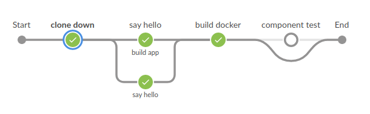

# Conditional branching



It may be that you're only interested in running a stage when a condition is met, e.g., you may only be interested in building the application on the `master` branch.  

## When directive

Jenkins adds the [`when` directive](https://jenkins.io/doc/book/pipeline/syntax/#when) that you can use inside a stage.

## PR based

There are some functions that you can use in the declarative pipeline.

```
        stage('Change request') {
          when { changeRequest() }
          steps {
            sh 'echo "this is a change request"'
          }
        }
```

## Branches

It's also possible to run stages on a specific branch.

```
        stage('Master branch build') {
          when { branch "master" }
          steps {
            sh 'Echo "On master branch"'
          }
        }
```

## Agent based conditions

If you're running the stage in a docker container, Jenkins will by default enter the agent (a docker container) and then evaluate the condition. You can disable this by adding `beforeAgent true` inside the `when`-block.

```
        stage('Compile on agent') {
            agent {
                docker "gradle:jdk11"
            }
            when {
                beforeAgent true
                branch 'master'
            }
            steps {
                sh 'ci/build-app.sh'
            }
        }
```

The directive `beforeAgent true` is useful to add because Jenkins otherwise will allocate an executor, checkout the code and then evaluate the condition. This will be pretty evident if your repository is a few gigabytes. Remember that an agent is not necessarily a docker container.

## Further reading

* [Pipeline when conditions](https://jenkins.io/blog/2018/04/09/whats-in-declarative/#new-when-conditions) List of functions that you can use inside a `when` block. 
* [Jenkins book: When directive](https://jenkins.io/doc/book/pipeline/syntax/#when) Description on how to use the `when` directive in a stage.
