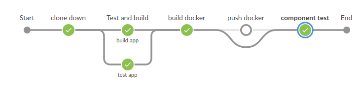

# Conditional branching



It may be that you're only interested in running a stage when a condition is met, e.g., you may only be interested in building the application on the `master` branch, and not running the full regression test on every branch that starts with `dev/` .

In the example above and this exercise, we only want to push the images build from `master` branch.

## When directive

Jenkins adds the [`when` directive](https://jenkins.io/doc/book/pipeline/syntax/#when) that you can use inside a stage to decide when the given step should be run.

``` Jenkinsfile
        stage('Master branch build') {
          when { branch "master" }
          steps {
            sh 'Echo "On master branch"'
          }
        }
```

### Tasks

This task is intentional more loosely formulated. Ask the instructor if you need guidance.

* We want only to push to dockerhub when our pipeline is running on `master`
* We want to run the component test in a stage of its own in the end of the pipeline. And it should run when the branch name is *not* starting with `dev/`. e.g. `dev/sal-working-branch`

> Note: You can execute the component test like: `sh 'ci/component-test.sh'`

## Agent based conditions

If you're running the stage in a docker container, Jenkins will by default enter the agent (a docker container) and then evaluate the condition. You can disable this by adding `beforeAgent true` inside the `when`-block.

```
        stage('Compile on agent') {
            agent {
                docker "gradle:6-jdk11"
            }
            when {
                beforeAgent true
                branch 'master'
            }
            steps {
                sh 'ci/build-app.sh'
            }
        }
```

The directive `beforeAgent true` is useful to add because Jenkins otherwise will allocate an executor, checkout the code and then evaluate the condition. This will be pretty evident if your repository is a few gigabytes. Remember that an agent is not necessarily a docker container.

## Further reading

* [Pipeline when conditions](https://jenkins.io/blog/2018/04/09/whats-in-declarative/#new-when-conditions) List of functions that you can use inside a `when` block.
* [Jenkins book: When directive](https://jenkins.io/doc/book/pipeline/syntax/#when) Description on how to use the `when` directive in a stage.
* [An end to end tutorial](https://jenkins.io/doc/tutorials/build-a-multibranch-pipeline-project/#end-to-end-multibranch-pipeline-project-creation) on a multibranch project usin NodeJS
