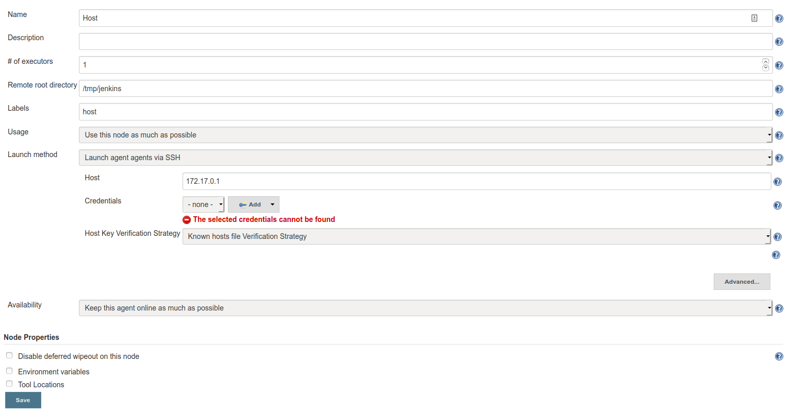
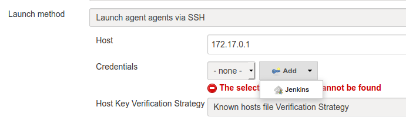
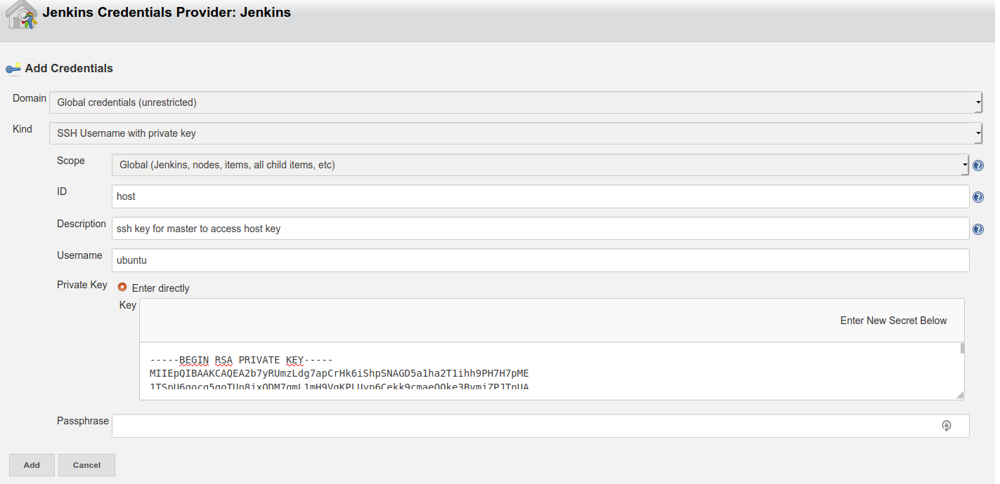

# Jenkins agent setup

In this exercise you will:

- Set up an agent on your host machine
- Set label on the agent and make sure it is used
  in a job
- Set the agent offline to see the implications in
  a job

## Setting up an ssh agent

When Jenkins comes up, the only thing it has is
itself as both master and agent.

We want to start a new agent directly on the host.
Remember, Jenkins is a Docker container, running
on the host.

### Tasks

First, we need to check if Java is installed on
the machine, since Jenkins is a java application.

- Run `java -version`, and see if the system
  returns a java version.
  - If it does not show, run the following script
    to install it
    `sudo apt update && sudo apt install -y openjdk-11-jdk`

Thereafter we need to add a new agent through the
Jenkins UI:

- Go to Manage jenkins -> manage nodes -> new node
  -> permanent agent.



On the screen, add the following:

- Remote root directory: /tmp/jenkins

- Label: host

- Host: <instance ip>

> Note: This ip-address is always the host
> ip-address from within the docker network. It is
> _not_ the local instance IP

- Host Key Verification Strategy: non verifying
  verification strategy

As we are using SSH, we need to add our SSH key to
the host as well.

- Under credentials, click add.



- Username: ubuntu
- Under private key, insert the content of the
  private key you got from the instructor.



- Assign an ID that can be used to access the
  credential. The Pipeline uses this ID to apply
  these credentials

- Click add.

- Click save.

## Choosing which agent to run your pipeline

You have now successfully set up your agent, and
can use that when running your pipeline.

### Tasks

Replace `agent any` in your pipeline with the
following:

```Jenkins
    agent {
        label 'host'
    }
```

Run it, and examine the pipeline.log (under
Artifacts) to see that the workspace it runs from
is the following:

```logs
[Pipeline] node
Running on Host in /tmp/jenkins/workspace/jenkins-katas_pipeline-editor
[Pipeline] {
```

## Swarming agents

In the prior way of connecting an agent, we let
the master connecting to the node in order to
establish the connection.

This can be used in situations where the instances
that needs to be added to Jenkins have static IP
addresses and are well known.

If that is not the case, like cloud instances etc,
it will be benneficial that the nodes makes the
initial contact. For that Jenkins provides a
plugin they call
[swarm](https://wiki.jenkins.io/display/JENKINS/Swarm+Plugin)
(not to be confused with Docker Swarm)

### Tasks

On your instance, download the swarm jarfile by
running the following command:

`wget https://repo.jenkins-ci.org/releases/org/jenkins-ci/plugins/swarm-client/3.17/swarm-client-3.17.jar`

After that, run your swarm jar file, that will
contact your Jenkins server and binds itself to
it. Remember to change the username and password
accordingly.

`java -jar swarm-client-3.17.jar -master http://127.0.0.1:8080 -username admin -password admin -labels swarm`

Replace your label in the pipeline from `host` to
`swarm like below`:

```Jenkins
    agent {
        label 'swarm'
    }
```

Run it, and examine the pipeline.log (under
Artifacts) to see that the workspace it runs from
is the a name with praqma-training:

```logs
[Pipeline] node
Running on soa-instance1.c.praqma-training.internal-cc550122 in /home/ubuntu/workspace/delme_master
[Pipeline] {
```

### Experiments

- What happens if you disable or delete one of the
  agents? What happens to the build that should be
  running on that agent?
- Can you have several agents with the same
  labels?
- Can you have several agents with the same name?
